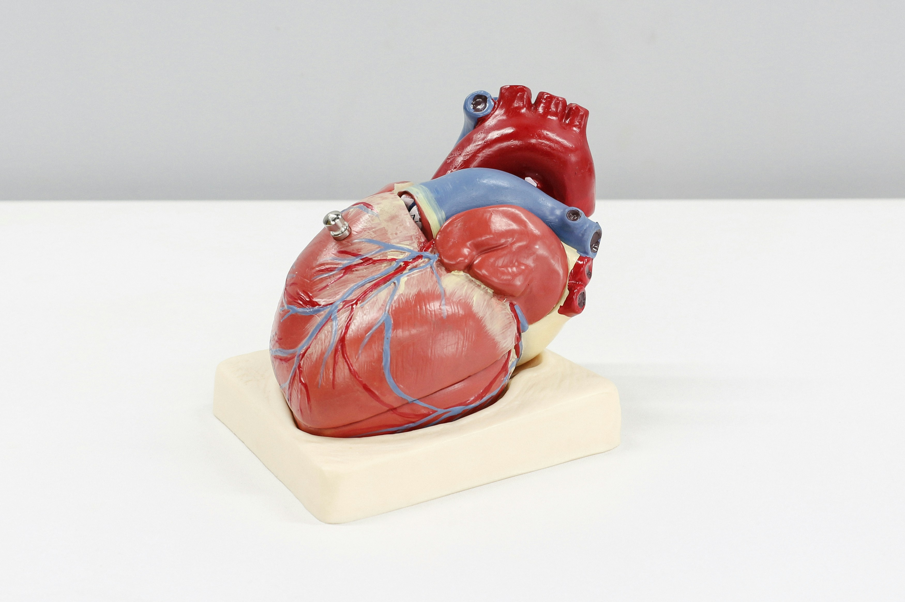

# CardioVascular-Risk-Prediction_classification-Model

<h3 align="Left">
 
Problem Statement:
 
The dataset originates from an ongoing cardiovascular study involving residents of Framingham, Massachusetts. Its primary aim is to predict whether a patient faces a 10-year risk of developing coronary heart disease (CHD). Comprising over 4000 records and 15 attributes, each attribute represents a potential risk factor, encompassing demographic, behavioral, and medical aspects.. 
 
<h3 Project Summary: </h3>
Tasked with analyzing a dataset from a cardiovascular study in Framingham, Massachusetts, comprising 3,390 rows and 17 features, my objective was to develop a model capable of predicting a patient's 10-year risk of coronary heart disease. Despite the absence of duplicate values, the dataset did contain some missing data in certain features, albeit at a manageable percentage. The features furnished valuable patient information, encompassing age, education, gender, smoking status, as well as health-related metrics such as cholesterol levels, diabetes status, blood pressure, BMI, glucose levels, and heart rate. 
 
1. Data Collection and Cleaning: 
* Gathered historical sales data for Rossmann stores, including competitor, holiday, customer, and daily sales details.
- Ensured data integrity by cleaning and preparing the dataset, handling missing values, and addressing outliers. 
 
2. Exploratory Data Analysis (EDA): 
- Conducted thorough EDA to extract insights through univariate, bivariate, and multivariate analysis.
- Utilized visualizations to identify patterns and trends, providing valuable insights for decision-making. 
 
3. Feature Engineering and Preprocessing:  
- Engineered new features like PromoDuration and Competition Distance to capture crucial information.
- Managed multicollinearity using VIF analysis and addressed outliers through the IQR technique.
- Applied One-Hot Encoding to categorical variables and employed transformation techniques for data normalization.
 
   
4. Model Selection and Training:  
- Split the preprocessed data into training and testing sets to assess model performance.
- Employed various machine learning algorithms, including linear regression, decision trees, and random forest, for sales prediction.  
   
- Evaluated model performance using metrics such as R-squared score, mean square error, and root mean square error.
- Utilized regularization techniques like Lasso, Ridge, and Elastic Net to enhance model performance.
 
   
5. Conclusion: 
- After experimentation, the XGBoost model emerged as the top performer, achieving an R2 score of approximately 98% on the training data and maintaining 97% on the test dataset.
- The model exhibited lower MSE and RMSE values compared to other models, indicating superior predictive accuracy.
- Consistent performance across multiple evaluation metrics demonstrates robust generalization.
- Residuals analysis confirmed the model's effectiveness in capturing underlying data patterns.
   
   
This project demonstrates the effective application of data analysis, feature engineering, and machine learning techniques to address real-world forecasting challenges in the retail industry, providing actionable insights for decision-making.  

</h3>
